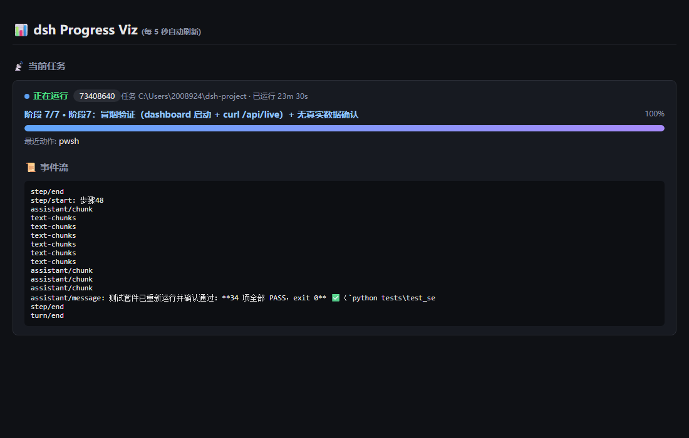

# dsh Progress Viz

[](https://github.com/2008924/dsh-progress-viz/actions/workflows/ci.yml) [](LICENSE) [](https://www.python.org/)

实时可视化 dsh（headless 模式）任务执行过程的独立看板工具包——读取会话事件流，呈现阶段进度、ETA 与实时动态流，纯本地运行。

> **English:** dsh Progress Viz is a self-contained dashboard that visualizes dsh headless task execution in real time. It parses the local session event stream (`session.jsonl.zstd`) to show stage progress, ETA and a live activity feed — 100% local, no API calls, no tokens consumed.



## 背景痛点

dsh 在 headless 模式下只输出**最终答案**，执行过程（读哪些文件、跑了什么命令、任务清单推进到哪一步）完全不可见。任务一跑就是几分钟甚至更久，期间无法判断：

- 任务是否还活着、卡在哪一步？
- 当前处于整个任务的哪个阶段、还剩多少阶段？
- 大概还要等多久？

## 原理

dsh 会把每次任务的完整事件流实时追加写入本地会话文件：

```
~/.dsh/sessions/<cwd编码>/<session-id>/session.jsonl.zstd
```

（zstd 压缩的 JSONL，每行一个事件，`type` 字段区分类型。）

本工具只关心三类事件：

| 事件类型 | 含义 | 用途 |
| --- | --- | --- |
| `todo/write` | 模型写入任务清单（`data.todos`，每项有 `content` + `status`） | **阶段数据源**：取第一个未完成项为当前阶段 |
| `step/start` | 步骤边界 | 无 todo 时的兜底计数 |
| `tool/call` | 工具调用（`data.name` + `data.arguments`） | 最近动作 + 事件流 |

解压必须用 zstandard 的 `stream_reader` 全量流式解压（`decompressobj` 只能解第一个 frame 是已知的坑）。看板每 4 秒轮询一次（重新扫描最近任务列表并逐任务解析），页面每 5 秒自动刷新。

## 安装与快速开始

```bash
# 方式一：只装依赖，直接运行脚本（无需安装本项目）
pip install "zstandard>=0.21"
python dashboard.py 8123

# 方式二：按项目安装（pyproject.toml，自动带上 zstandard 依赖）
pip install .
python dashboard.py 8123        # 或 python -m dashboard 8123
```

> 本项目是**纯脚本型**包（无 console script 入口、不提供 `import` 模块），
> `pip install .` 只是安装依赖并注册元信息；运行方式与直接运行脚本完全一致：
> 在项目目录执行 `python dashboard.py [port]`（或 `python -m dashboard [port]`）。

启动行为：

- **自动打开浏览器**：服务器启动成功后自动用系统默认浏览器打开
  <http://127.0.0.1:<实际端口>>；
- **端口冲突自动递增**：指定端口（或默认 8123）被占用时自动 +1 重试
  （最多 5 次），并打印「端口 X 被占用，改用 Y」；连续 5 个端口都被占用才报错退出；
- **`--no-open`**：启动时不自动打开浏览器（如远程/无头环境）：
  `python dashboard.py 8123 --no-open`。

浏览器打开 <http://127.0.0.1:8123>：

- **多任务分栏**：看板扫描 `~/.dsh/sessions` 下**全部**会话，只保留**最近 1 小时**内有写入
  （文件 mtime 距今 < 3600s）的任务，按 mtime 降序取**前 8 个**，以网格分栏展示
  （≥1400px 三列 / ≥900px 两列 / 其余单列，响应式）；
- **运行中卡片**（mtime 距今 ≤ 30s）：绿色状态点「正在运行」+ 任务 cwd + 会话 id（前 8 位）+
  已运行时长 + 阶段进度条（阶段 k/N + 名称）+ ETA（预计完成时刻 + 剩余时间 + 推算方式）+
  事件流（默认展开，max-height 滚动）；
- **已完成卡片**（mtime 距今 > 30s）：灰色「已完成」+ cwd + 耗时 + 最后阶段名
  （stage 或「步骤N」），事件流**默认折叠**（点击展开），避免信息过载；
- **无任务时**：显示"等待 dsh 任务开始..."，启动一个 dsh headless 任务后自动出现分栏；
- 标题区实时显示任务总数（如「共 3 个任务 · 每 5 秒自动刷新」）。

`/api/live` 返回最近任务列表 JSON：`{"tasks": [ {id, cwd, status, stage, stage_idx,
stage_total, stage_pct, action, eta_s, eta_mode, eta_at, elapsed_s, tail} ]}`，
无任务时 `tasks=[]`。每个任务的 ETA 独立计算（融合算法复用，历史会话排除任务自身）；
单个会话扫描/解析失败会静默跳过，不影响其他任务。

## 阶段与 ETA 说明

- **阶段**来自模型的 `todo/write` 任务清单（取第一个未完成项，idx 从 1 开始）；模型**必须使用 todo 工具**维护清单才能显示阶段。建议在任务提示里引导，例如：

  ```
  【输出约定】请使用 todo 工具维护你的任务清单：每个主要步骤列一项
  （开始标记 in_progress、完成标记 completed，清单变化时更新）。
  ```

- **ETA** 为**线性外推 + 历史均值融合**：
  - **线性分量 linear_s**：已走过阶段的平均耗时 × 剩余阶段数；
  - **历史分量 hist_s**：同 cwd 目录下**历史会话**（排除当前监控会话）耗时的**中位数**
    （每个历史会话耗时 = 事件流最大 `time` − 最小 `time`；无历史/扫描失败时视为不可用）；
  - **融合公式**：`eta = α·linear_s + (1−α)·hist_s`，α 随阶段进度自适应：
    `k≥3 → α=0.7`，`k==2 → α=0.5`，`k<2 → α=0`（纯历史均值）；
  - **回退链**（`eta_mode` 标记）：有阶段信息（k≥2 且 n>k）且历史可用 → `blend`；
    有阶段但无历史 → 纯 `linear`（α=1）；无阶段但有历史 → 纯 `history`（α=0）；都无 → `none`（不显示 ETA）；
  - 历史会话每次全量扫描（会话数少，代价可接受），结果按会话目录 mtime 缓存，
    4 秒轮询时 mtime 未变化直接复用 hist_s。

## 测试

```bash
python tests/make_fixtures.py          # 生成合成 fixtures（无真实会话数据）
python tests/test_session_progress.py  # 跑全部单测（无需 pytest），exit 0 全过
python tests/test_eta_blend.py         # ETA 融合算法单测（历史会话 fixture 生成到临时目录）
python tests/test_multi_pane.py        # 多任务分栏单测（1 小时窗口 / mtime 排序 / status 判定）
python tests/test_tail_format.py       # tail 可读性单测（chunk 合并 / 时间戳 / 动作高亮 / 截断）
python tests/test_port.py              # 端口冲突自动递增单测（socket 占用模拟，随机高位端口）
python tests/test_cache.py             # 解析缓存单测（mtime 未变不重新解压 / 修改后重解析 / 缓存清理）
```

GitHub Actions CI（`.github/workflows/ci.yml`）在 push 到 main 与 pull_request 时，
以 ubuntu / macos / windows × Python 3.9 / 3.11 六种组合逐套运行上述单测。

## 常见问题

遇到「zstandard 未安装」「看不到任务」「端口被占用」「路径显示异常」「显示步骤N
而不是任务名」「任务完成后卡片还在」「如何卸载/停止看板」等问题，请查阅
**[docs/FAQ.md](docs/FAQ.md)**（7 问 7 答）。

## 文件结构

```
dsh-progress-viz/
├── .github/workflows/ci.yml # GitHub Actions CI（3 平台 × 2 Python 矩阵）
├── dashboard.py          # 独立看板服务器（全库扫描 + 4s 轮询 + 解析缓存 + 多任务分栏 + ETA）
├── session_progress.py   # 会话事件流 → 阶段解析器（纯本地）
├── index.html            # 看板页面（深色主题，多任务网格分栏，5s 自动刷新）
├── pyproject.toml        # 项目元信息 / 依赖声明（pip install . 用）
├── tests/
│   ├── make_fixtures.py              # 合成 fixtures 生成器（含历史会话 fixture）
│   ├── test_session_progress.py      # 单测（无需 pytest）
│   ├── test_eta_blend.py             # ETA 融合算法单测
│   ├── test_multi_pane.py            # 多任务分栏单测
│   ├── test_tail_format.py           # tail 可读性单测
│   ├── test_port.py                  # 端口冲突自动递增单测
│   ├── test_cache.py                 # 解析缓存单测
│   └── fixtures/session-synthetic.jsonl.zstd
├── docs/
│   ├── FAQ.md            # 常见问题（7 问 7 答）
│   └── screenshot.png    # 看板效果图
├── README.md
├── LICENSE
└── requirements.txt
```

## License

MIT（Copyright (c) 2026 dsh-progress-viz contributors）
